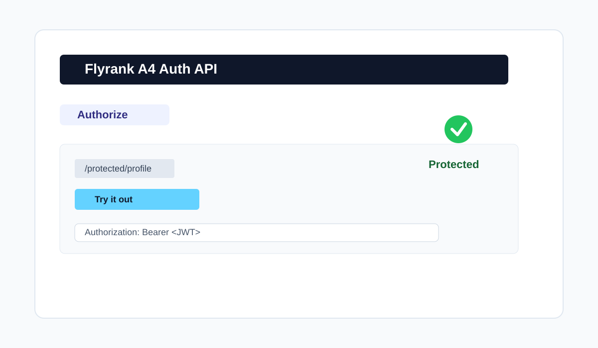

# Flyrank A4: Auth Login & Protect

This project implements the authentication flow described in the PRD using a Next.js server, Supabase Auth, JWT verification, reusable middleware, and Swagger UI for API testing.

## Project goals
- Sign up and log in via Supabase Auth
- Protect routes with a bearer token middleware
- Return the exact expected status codes from the assignment
- Document the API with Swagger UI at `/docs`
- Keep secrets in `.env` and never commit them

## Quick start

1. Install dependencies:
   ```bash
   npm install
   ```

2. Copy the environment sample:
   ```bash
   copy .env.example .env
   ```

3. Fill in your real Supabase values in `.env`:
   ```env
   SUPABASE_URL=https://your-project.supabase.co
   SUPABASE_KEY=your-anon-key
   PORT=3000
   ```

4. Start the app:
   ```bash
   npm run dev
   ```

5. Open:
   - API docs: http://localhost:3000/docs
   - Public endpoint: http://localhost:3000/public/info

## Environment configuration

The app reads values from `.env` and uses them to initialize the Supabase client. Never commit `.env` or any real Supabase secrets.

Example:
```env
SUPABASE_URL=https://my-project.supabase.co
SUPABASE_KEY=abc123xyz
PORT=3000
```

## API reference

| Method | Route | Auth required | Purpose |
|---|---|---|---|
| POST | `/auth/signup` | No | Create a user account |
| POST | `/auth/login` | No | Log in and receive a JWT |
| POST | `/auth/logout` | Yes | Sign out the current user |
| GET | `/protected/profile` | Yes | Read the authenticated profile |
| GET | `/protected/dashboard` | Yes | Read protected dashboard data |
| GET | `/public/info` | No | Read public info |

## Status codes

- `200`: successful login or read
- `201`: successful signup
- `204`: successful logout
- `400`: missing or invalid request data
- `401`: missing, malformed, expired, or invalid token

## Middleware and auth flow

The reusable middleware in `lib/middleware/requireAuth.js`:
- reads the `Authorization: Bearer <token>` header
- rejects missing or malformed headers with `401`
- verifies the token through `supabase.auth.getUser(token)`
- attaches the verified user to `req.user`
- allows protected handlers to run only when authentication succeeds

## Swagger UI

The project exposes Swagger UI at `/docs` using `swagger-ui-express` and the OpenAPI document in `openapi.json`.

The security scheme is defined as:
```yaml
securitySchemes:
  bearerAuth:
    type: http
    scheme: bearer
    bearerFormat: JWT
```

### Swagger screenshot



## Project structure

```text
.
├── .env.example
├── .gitignore
├── README.md
├── docs/
│   └── swagger-ui-screenshot.svg
├── lib/
│   ├── middleware/
│   │   └── requireAuth.js
│   └── supabaseClient.js
├── openapi.json
├── pages/
│   ├── api/
│   │   ├── auth/
│   │   │   ├── login.js
│   │   │   ├── logout.js
│   │   │   └── signup.js
│   │   ├── protected/
│   │   │   ├── dashboard.js
│   │   │   └── profile.js
│   │   └── public/
│   │       └── info.js
│   └── index.js
├── package.json
├── server.js
└── .env
```

## Notes

- This project follows the PRD from the assignment and uses Supabase as the identity provider.
- The app is intentionally built so that a teammate can clone the repo, add their own `.env` values, and run the project locally in a few minutes.
